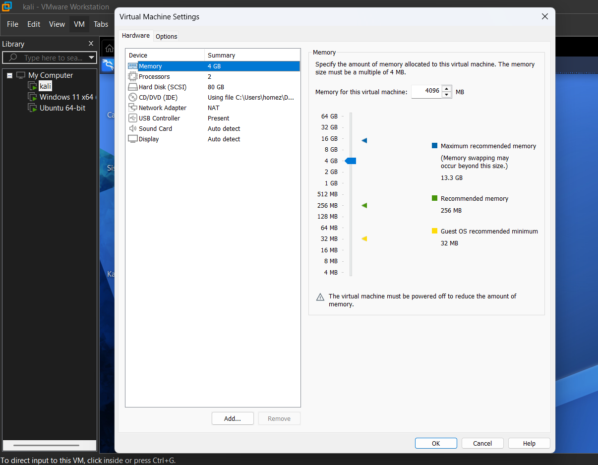
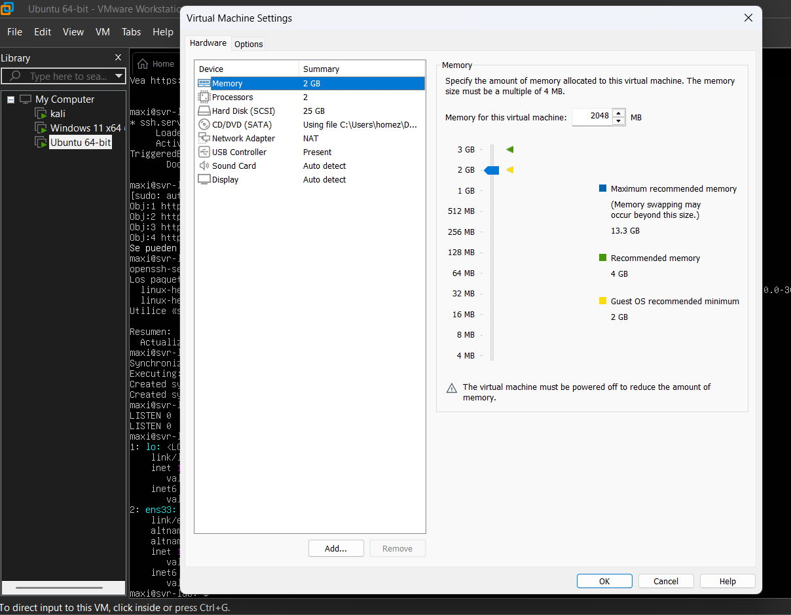
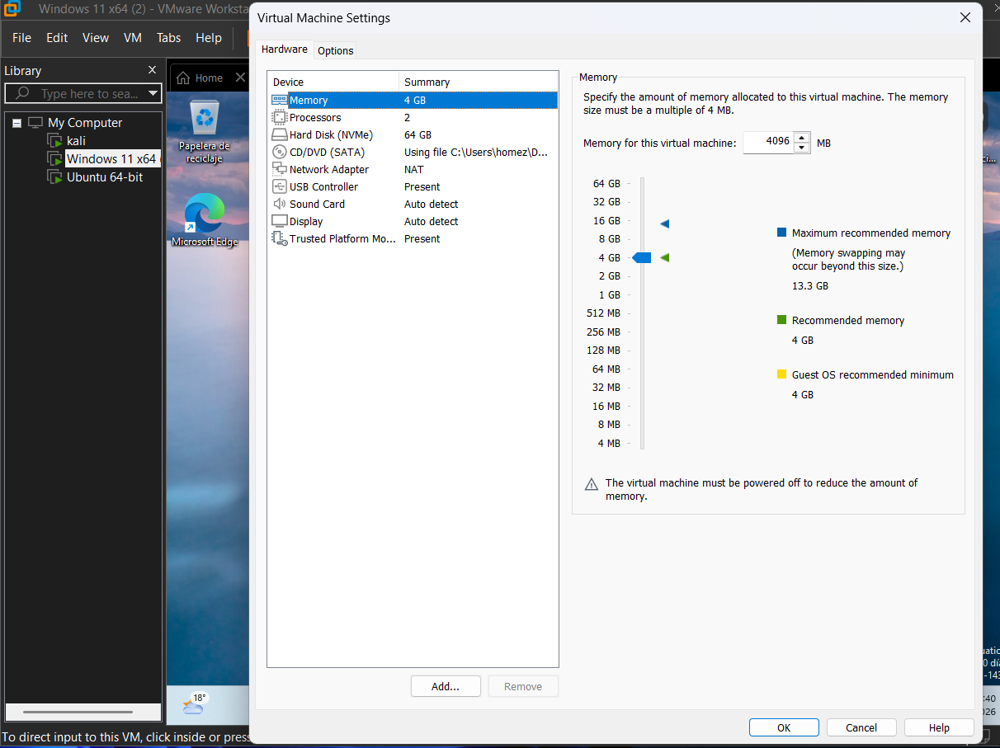
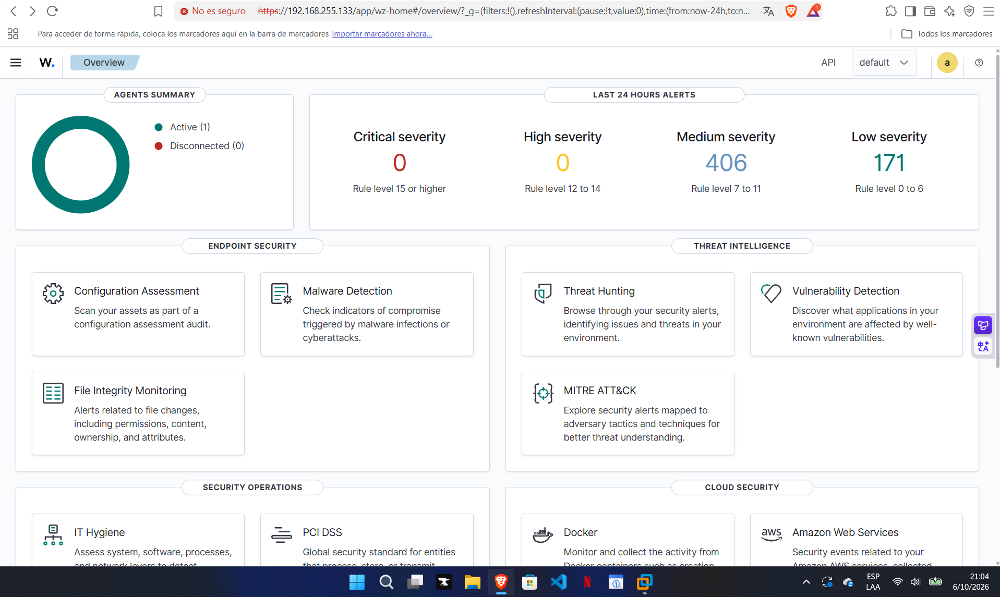
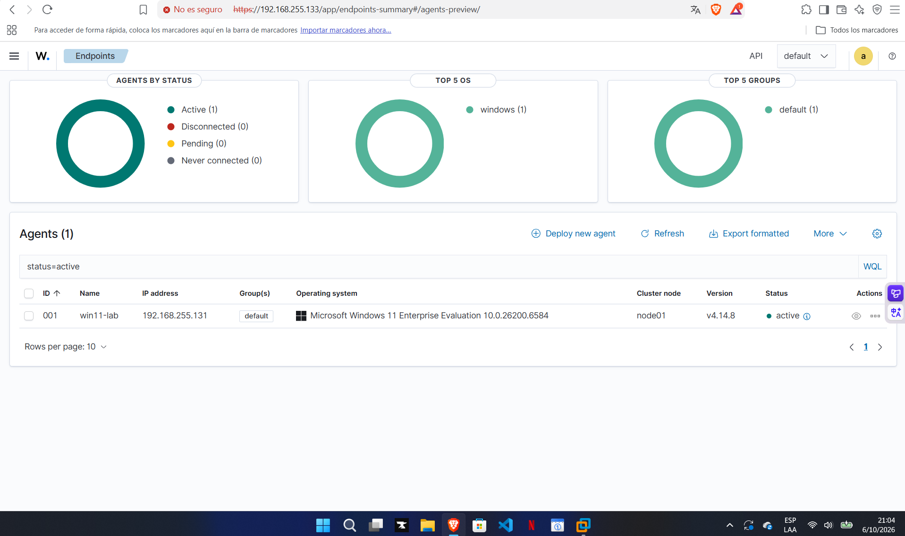
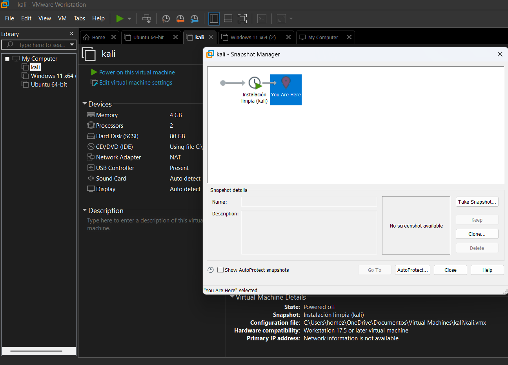
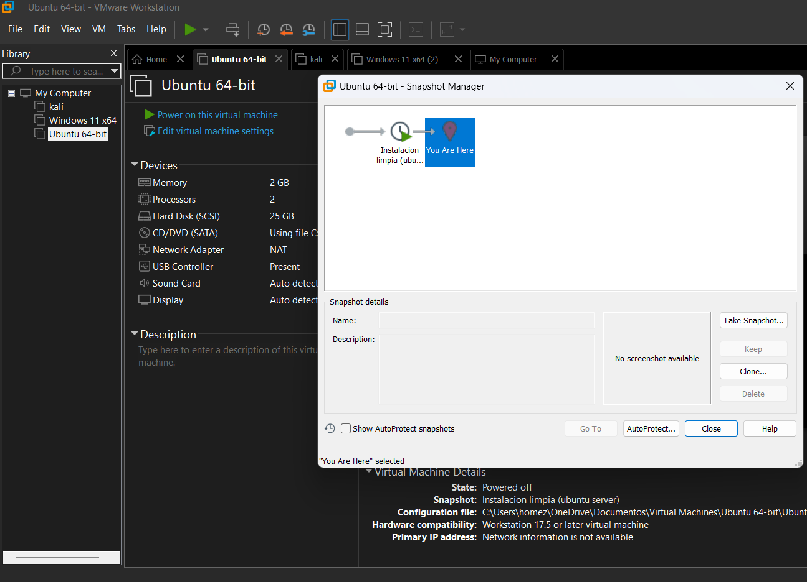
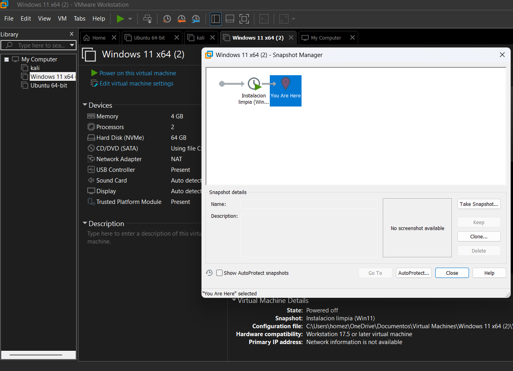

# 🛡️ Home Lab Setup: Virtual Cybersecurity Lab

A hands-on virtual lab built on VMware Workstation to practice Blue Team skills: monitoring, log analysis and incident detection. This repository documents the build process, decisions and lessons learned.

**Related repo:** [wazuh-detection-lab](https://github.com/mxcyberlab/wazuh-detection-lab) — attack simulations and incident reports based on this lab.

## 🎯 Objectives
- Build an isolated environment to practice safely
- Deploy a SIEM and collect logs from multiple systems
- Simulate attacks and analyze the resulting alerts
- Document every step as a reproducible guide

## 🏗️ Lab Architecture

| Machine | OS | Role | Status |
|---|---|---|---|
| Attacker | Kali Linux | Offensive tools, attack simulation | ✅ Done |
| Server | Ubuntu Server 24.04 LTS | Wazuh SIEM (manager, indexer, dashboard) | ✅ Done |
| Workstation | Windows 11 Enterprise (evaluation) | Windows endpoint, monitored by Wazuh agent | ✅ Done |

**Network:** all VMs on VMware NAT, in the same virtual network.

**Host:** Windows 11, 16 GB RAM.


## ⚙️ Setup Summary

### 1. Kali Linux
- Pre-built VMware image from kali.org
- [4] GB RAM, [2] vCPUs, [80] GB disk
- Updated and snapshot taken




### 2. Ubuntu Server (Wazuh)
- Installed from ISO, OpenSSH server enabled
- [8] GB RAM, [4] vCPUs, 50 GB disk (expanded, see troubleshooting)
- Clean snapshot taken after install




### 3. Windows 11
- Installed from Microsoft's evaluation ISO
- [4] GB RAM, [2] vCPUs, [64] GB disk
- Clean snapshot taken after install




## 🔍 SIEM: Wazuh

Deployed **Wazuh 4.14** on the Ubuntu Server using the official installation assistant (manager, indexer and dashboard on the same host). Installed the Wazuh agent on the Windows 11 VM, which now reports to the server.




First detection: simulated SSH password guessing from Kali, which triggered a level 10 brute force alert mapped to MITRE ATT&CK T1110. Full write-up in [Incident Report 001](https://github.com/mxcyberlab/wazuh-detection-lab/blob/main/reports/incident-001-ssh-brute-force.md).

## 🔗 Connectivity Tests

Verified communication between machines with `ping` and an SSH session from Kali to Ubuntu Server:

```bash
ssh user@<ubuntu-server-ip>
```


Windows blocks ICMP by default, so I enabled an inbound firewall rule to allow ping in the lab:

```
netsh advfirewall firewall add rule name="ICMP Allow" protocol=icmpv4:8,any dir=in action=allow
```

## 📸 Snapshots

A clean snapshot was taken on every VM right after installation, to allow safe experimentation and quick recovery.





## 🧩 Troubleshooting Log

### 1. SSH: `Connection refused`
**Cause:** the SSH service was not running on the target machine.
**Fix:**
```bash
sudo apt install openssh-server -y
sudo systemctl enable --now ssh
```
**Lesson:** "Connection refused" means the host is reachable but nothing is listening on that port. It's a service issue, not a network one.

### 2. Wazuh install failed: `No space left on device`
**Cause:** the Ubuntu installer only allocated part of the disk to the root volume, and the Wazuh packages filled it before the dashboard could install. The installation assistant rolled back automatically.
**Fix:** expanded the virtual disk to 50 GB (snapshots had to be deleted first), then extended the partition and logical volume:
```bash
sudo growpart /dev/sda 3
sudo pvresize /dev/sda3
sudo lvextend -l +100%FREE -r /dev/ubuntu-vg/ubuntu-lv
```
**Lesson:** check `df -h /` and the official hardware requirements before deploying heavy services.

### 3. Re-install blocked: `Wazuh manager already installed`
**Cause:** the failed installation left the `wazuh-manager` package half-removed, and its uninstall script failed (exit status 127) because its files were already deleted.
**Fix:** moved the broken maintainer scripts out of `/var/lib/dpkg/info/`, purged the package with `dpkg --purge --force-all`, and re-ran the installer with the overwrite option.
**Lesson:** a failed rollback can leave the package manager in an inconsistent state. This kind of manual fix is acceptable in a lab with snapshots, not in production.

## 📝 Lessons Learned
- Choosing the correct *guest OS* in VMware matters for VM configuration
- Snapshots allow safe experimentation and quick recovery
- Always verify the service on the target before blaming the network
- Windows Firewall blocks ping by default, so a failed ping doesn't always mean a broken network
- A SIEM needs real resources: disk space and RAM must be planned before installing
- Reading the installer log (`/var/log/wazuh-install.log`) found the root cause faster than guessing

## 🗺️ Next Steps
- [x] Build the three VMs (Kali, Ubuntu Server, Windows 11)
- [x] Verify connectivity between machines
- [x] Deploy Wazuh (SIEM) and connect the Windows agent
- [x] Simulate an attack from Kali and analyze the alert (Incident Report 001)
- [ ] Detect failed logons on Windows (Incident Report 002)
- [ ] Test what Wazuh does and doesn't detect (e.g., port scans)
- [ ] Add the Ubuntu Server as a monitored agent

## ⚠️ Disclaimer
This lab is isolated and used for educational purposes only. All testing is performed on systems I own.
