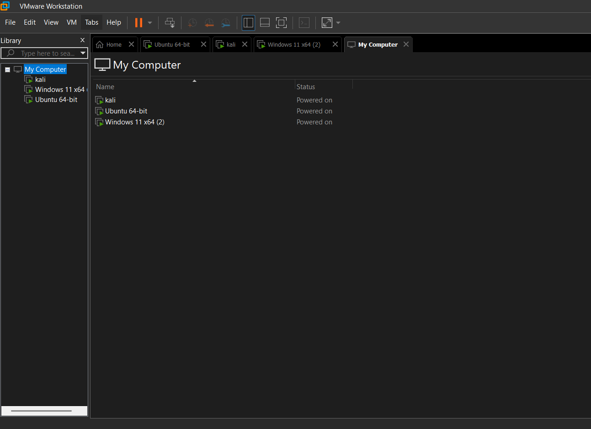
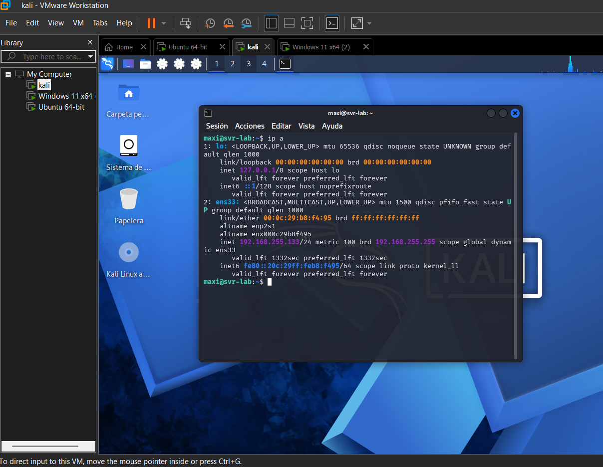
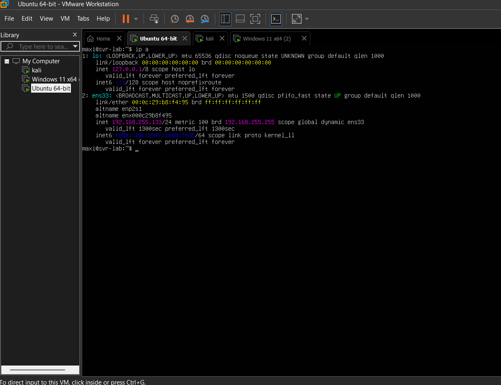
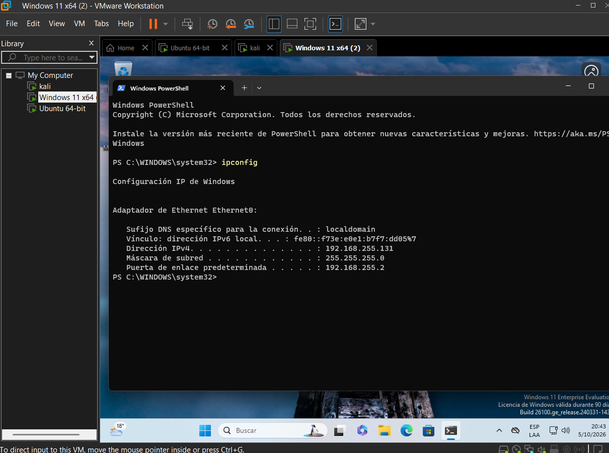
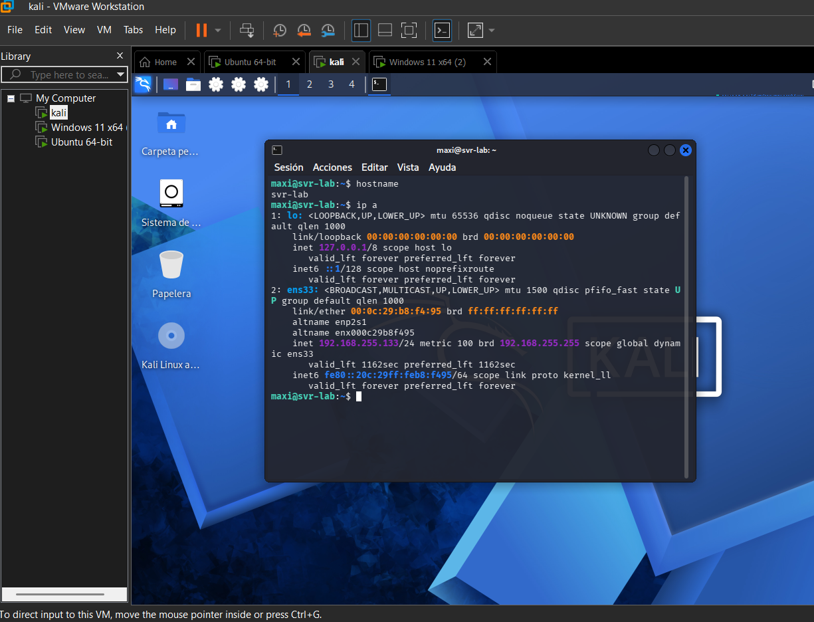
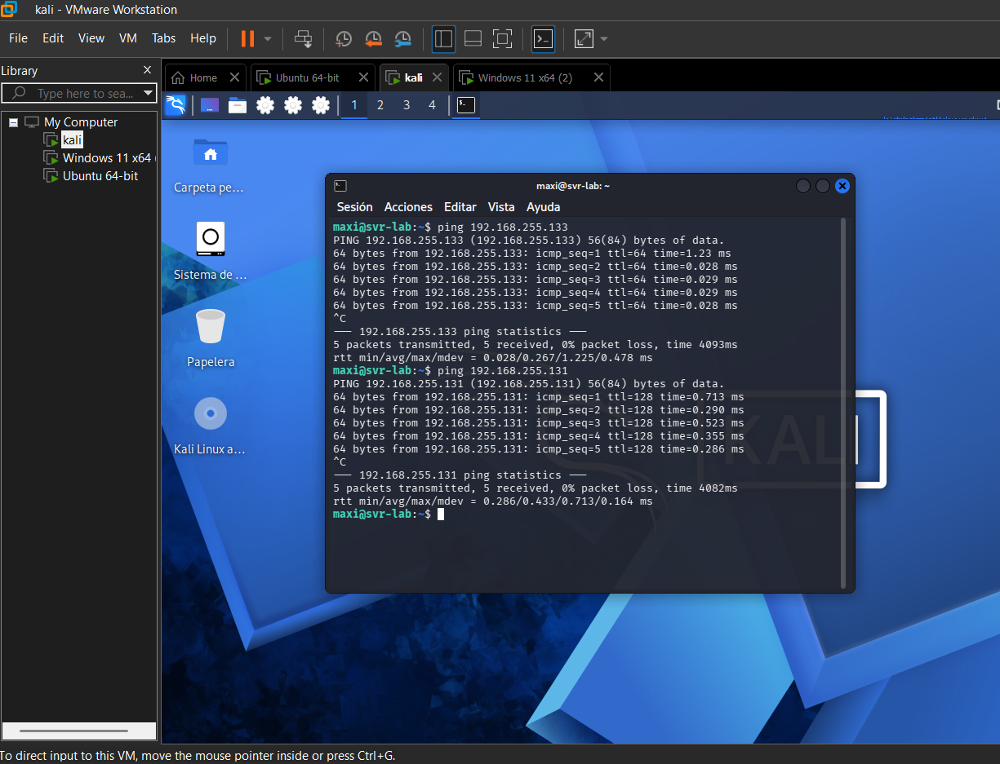

# 🛡️ Home Lab Setup: Virtual Cybersecurity Lab

A hands-on virtual lab built on VMware Workstation to practice Blue Team skills: monitoring, log analysis and incident detection. This repository documents the build process, decisions and lessons learned.

## 🎯 Objectives
- Build an isolated environment to practice safely
- Deploy a SIEM and collect logs from multiple systems
- Simulate attacks and analyze the resulting alerts
- Document every step as a reproducible guide

## 🏗️ Lab Architecture

| Machine | OS | Role | Status |
|---|---|---|---|
| Attacker | Kali Linux | Offensive tools, attack simulation | ✅ Done |
| Server | Ubuntu Server 24.04 LTS | Linux target / future SIEM host | ✅ Done |
| Workstation | Windows 11 Enterprise (evaluation) | Windows target | ✅ Done |

**Network:** all VMs on VMware NAT, in the same virtual network.

**Host:** [16] GB RAM, [12th Gen Intel(R) Core(TM) i7-1255U (1.70 GHz)], Windows 11.



## ⚙️ Setup Summary

### 1. Kali Linux
- Pre-built VMware image from kali.org
- [4] GB RAM, [2] vCPUs, [80] GB disk
- Updated and snapshot taken



### 2. Ubuntu Server
- Installed from ISO, OpenSSH server enabled
- [2] GB RAM, [2] vCPUs, [25] GB disk
- Clean snapshot taken after install



### 3. Windows 11
- Installed from Microsoft's evaluation ISO
- [4] GB RAM, [2] vCPUs, [64] GB disk
- Clean snapshot taken after install



### VM Specifications


## 🔗 Connectivity Tests

Verified communication between machines with `ping` and an SSH session from Kali to Ubuntu Server:

```bash
ssh user@<ubuntu-server-ip>
```




Windows blocks ICMP by default, so I enabled an inbound firewall rule to allow ping in the lab:

```
netsh advfirewall firewall add rule name="ICMP Allow" protocol=icmpv4:8,any dir=in action=allow
```

## 📸 Snapshots

A clean snapshot was taken on every VM right after installation, to allow safe experimentation and quick recovery.


## 🧩 Troubleshooting Log

**Problem:** `Connection refused` when connecting by SSH from Kali.
**Cause:** the SSH service was not running on the target machine (Ubuntu Server).
**Fix:** installed and enabled the service:
```bash
sudo apt install openssh-server -y
sudo systemctl enable --now ssh
```
**Lesson:** "Connection refused" means the host is reachable but nothing is listening on that port. It's a service issue, not a network one.

## 📝 Lessons Learned
- Choosing the correct *guest OS* in VMware matters for VM configuration
- Snapshots allow safe experimentation and quick recovery
- Always verify the service on the target before blaming the network
- Windows Firewall blocks ping by default, so a failed ping doesn't always mean a broken network

## 🗺️ Next Steps
- [x] Build the three VMs (Kali, Ubuntu Server, Windows 11)
- [x] Verify connectivity between machines
- [ ] Deploy Wazuh (SIEM) and connect agents
- [ ] Simulate attacks from Kali and analyze alerts
- [ ] Write incident reports

## ⚠️ Disclaimer
This lab is isolated and used for educational purposes only. All testing is performed on systems I own.
